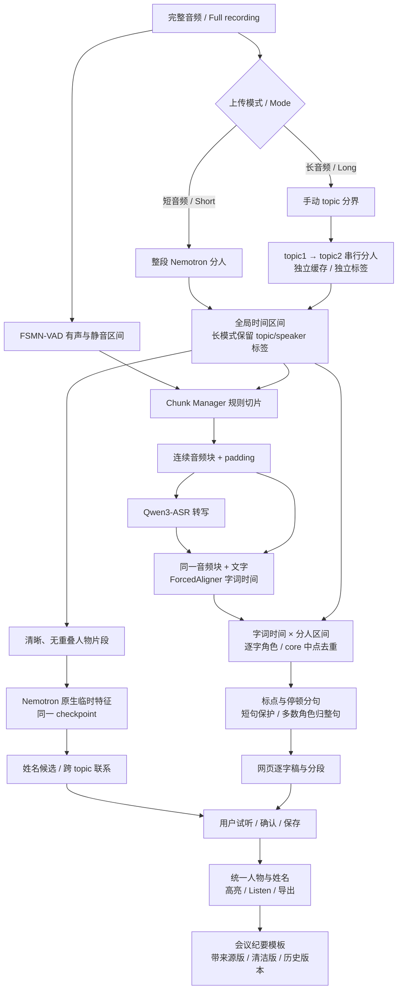

<p align="center"></p>

# 会记P · Huiji P

**面向中文会议的自托管语音转写、说话人区分与会议纪要工作台。**

[English](README.en.md) · [安装](docs/INSTALL.md) · [完整架构](docs/ARCHITECTURE.md) · [模型说明](docs/MODELS.md) · [使用指南](docs/USAGE.md) · [数据与备份](docs/DATA.md)

基于 [Scriberr](https://github.com/rishikanthc/Scriberr) 开发。转写、分人和原生特征推荐在本地运行；会议纪要可连接用户配置的本地或外部 LLM。本仓库保存代码和说明，不附带模型权重及会议数据。

## 能做什么

| 功能 | 实际行为 |
| --- | --- |
| 短音频 | 整段 Nemotron 分人，生成字词时间和逐字稿 |
| 长会议 | 用户手动设置 topic 分界，各 topic 独立分人，串行执行 |
| 人物统一 | 保留 topic 独立标签，推荐跨 topic 联系，用户确认后合并人物显示 |
| 姓名推荐 | 用同一 Nemotron checkpoint 的原生特征，与管理员登记样本匹配候选 |
| 阅读与复核 | 字词高亮、试听、Listen 跳转、人物改名、转写导出 |
| 会议纪要 | 自选模板、带来源版与清洁版、历史生成版本 |
| 多用户 | 个人录音、逐字稿及纪要权限隔离；管理员管理账号与共享配置 |

## 我们的优势

- **中文会议模型组合**：Qwen3-ASR转写、Nemotron分人、ForcedAligner定位字词，支持沿时间轴试听复核。
- **结合语音结构切片**：Chunk Manager利用静音与人物区间，保留上下文，并去除padding重复文字。
- **长会议按topic管理人物**：每段独立缓存和标签，适应发言阵容变化；各段在容量内时，全场可统一超过8位人物。
- **姓名与人物联系可确认**：同一Nemotron checkpoint的原生特征推荐，用户试听后统一身份。
- **纪要可追溯**：带来源版、清洁版、可选模板与历史生成版本，连接复核与分享。

[优势与适用边界](docs/ADVANTAGES.md)详细说明中英文/方言能力、8人容量、分topic策略与性能证据。当前桥接固定中文，跨topic联系需人工确认；尚无与商业产品的同条件评测。

## 从录音到纪要



### 完整处理流程

```text
完整音频 ──┬──→ 短音频：整段运行 Nemotron
          │                   │
          ├──→ 长音频：按手动时间点划分 topic
          │                   ↓
          │       各 topic 串行运行 Nemotron（Sortformer 系列）
          │       每个 topic 独立缓存、独立说话人标签
          │                   ↓
          │       恢复完整音频时间轴，保留各 topic 人物标签
          │                   │
          │                   ├──→ 全局说话人时间区间 ───────────────┐
          │                   │                                    │
          │                   └──→ 各 topic 人物的清晰语音片段      │
          │                                      ↓                 │
          │                           Nemotron 自身生成临时特征     │
          │                           （同一 checkpoint，不用 TitaNet）│
          │                                      ↓                 │
          │                       声纹库姓名候选 + 跨 topic 人物联系 │
          │                              保存，等待用户确认         │
          │                                                        │
          └──→ FSMN-VAD ──→ 有声/静音区间 ──┐                       │
                                            ↓                       │
                              Chunk Manager（规则切片）←───────────┘
                                            ↓
                            保留静音的连续音频块（含 padding）
                                            ↓
                                 Qwen3-ASR 转写文字
                                            ↓
                    同一音频块 + 对应文字 → ForcedAligner 字词时间
                                            ↓
                  字词时间 × Nemotron 区间 → 原始逐字角色（兜底）
                                            ↓
                      核心区间按字词中点去重 → 全局文字串联
                                            ↓
                标点/停顿形成自然分句 → 短分句保护 → 多数角色归整句
                                            ↓
                              网页逐字稿与说话人分段
                                            ↓
                      用户试听姓名候选、跨 topic 人物联系
                                            ↓
                           确认并保存 → 统一人物与姓名
                                            ↓
                              网页显示 / Listen / 导出
                                            ↓
                      按需生成会议纪要（带来源版 / 清洁版）
                                            ↓
                           模板选择 / 历史版本 / 再次查看
```

“合并为全局区间”只恢复时间轴，不自动把两个 topic 的同号 speaker 合成同一人。topic 分界由用户指定，不是 AI 自动识别话题。后续 Chunk Manager 针对整段音频规划，默认不强制在 topic 边界切块。详见 [架构与时间规则](docs/ARCHITECTURE.md)。

## 模型各司其职

| 组件 | 负责 | 不负责 |
| --- | --- | --- |
| Nemotron-3-Diarization | 谁在什么时候说话，最多八个本地通道 | 转写、直接认出姓名 |
| FSMN-VAD | 语音与静音区间 | 人物身份、文字 |
| Chunk Manager | 约 10–30 秒连续音频块和上下文 padding | 神经模型、自动话题识别 |
| Qwen3-ASR-1.7B | 音频转文字 | 可靠姓名核验 |
| Qwen3-ForcedAligner-0.6B | 音频与给定文字的字词时间对齐 | 修正 ASR 错词、分人 |
| Nemotron 原生特征推荐 | 姓名和跨 topic 联系候选 | 自动确认身份、训练官方声纹验证模型 |
| 配置的 LLM | 会议纪要和基于文字的问答 | 修改原始分人时间轴 |

[模型详情](docs/MODELS.md) 包含权重大小、输入输出、适用场景、限制、官方来源及当前依赖版本。当前标准流程不使用 TitaNet。

## 安装入口

推荐目标是 **Linux + NVIDIA GPU + Python 3.12**。目前实际部署在 A100 上；未宣称 Windows、macOS 或小显存 GPU 的完整链路已经验收。

```bash
git clone https://github.com/xiaoqiangq/huiji-p.git
cd huiji-p
```

这是私有仓库，先用自己的 GitHub 账号认证。之后按 [逐步安装指南](docs/INSTALL.md) 完成：系统依赖 → 前端/Go 构建 → 独立 Python 环境 → 模型下载 → 运行检查 → 网页启动 → 首次管理员和模型配置。指南提供每一步命令、目录、成功条件和故障处理。

| 验证范围 | 状态 |
| --- | --- |
| 网页及 Linux amd64 Go 构建 | 已验证 |
| 已部署 A100 中文链路 | 已运行；文档与其配置核对 |
| 安装脚本静态检查、dry-run 与目录检查 | 见安装指南验收说明 |
| 在全新服务器从零安装 | 参考步骤，尚未完成独立端到端验收 |

## 使用与数据边界

首次空数据库创建初始管理员，之后由管理员管理账号。上传短音频或长音频后检查模型参数，等待完成，再试听姓名及人物联系，最后生成纪要。详见 [使用指南](docs/USAGE.md)。

录音、数据库、声纹样本、API 密钥和模型缓存不进入 Git。外部 LLM 会接收提交给它的文字和人物信息；若需全程本地处理，请配置本地 LLM。[数据与备份](docs/DATA.md) 说明存储位置及删除、备份边界。

## 当前限制

重叠、噪声、远距离收音和音色变化仍可能让一个人物被拆分或多个人物被混入同一标签。原生特征相似度不是身份概率；跨 topic 合并和姓名都需人工确认。尚无按用户容量配额、完整 GPU 调度及通用一键安装包。

## 许可证与致谢

保留 Scriberr 的 [MIT LICENSE](LICENSE) 与版权声明；[来源说明](docs/ATTRIBUTION.md) 和 [上游 README](docs/UPSTREAM-README.md) 单独保留。模型、图形素材与第三方依赖按各自授权使用。

## 工程与发布

[Docker deployment](docs/DEPLOY.en.md) · [部署说明](docs/DEPLOY.md) · [Validation status](docs/VALIDATION.md) · [Release policy](docs/RELEASE.md) · [Changelog](CHANGELOG.md)

默认 Compose 已构建会记P源码。当前尚无经过完整从零 GPU 验收的稳定发布；模型环境与权重需另外准备。CI 与 tag workflow 负责自动检查和候选打包，生产部署由管理员确认验收后执行。
